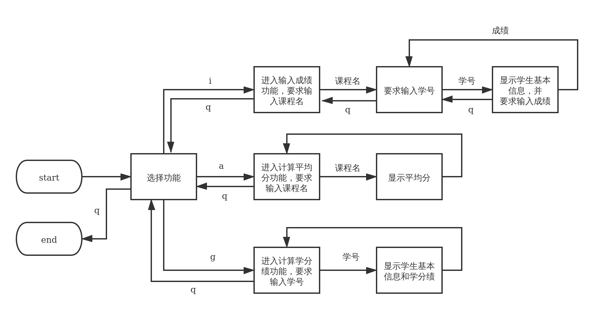
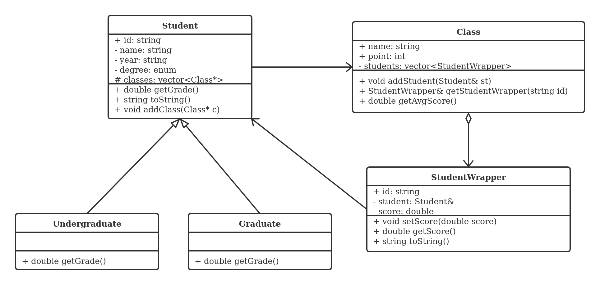
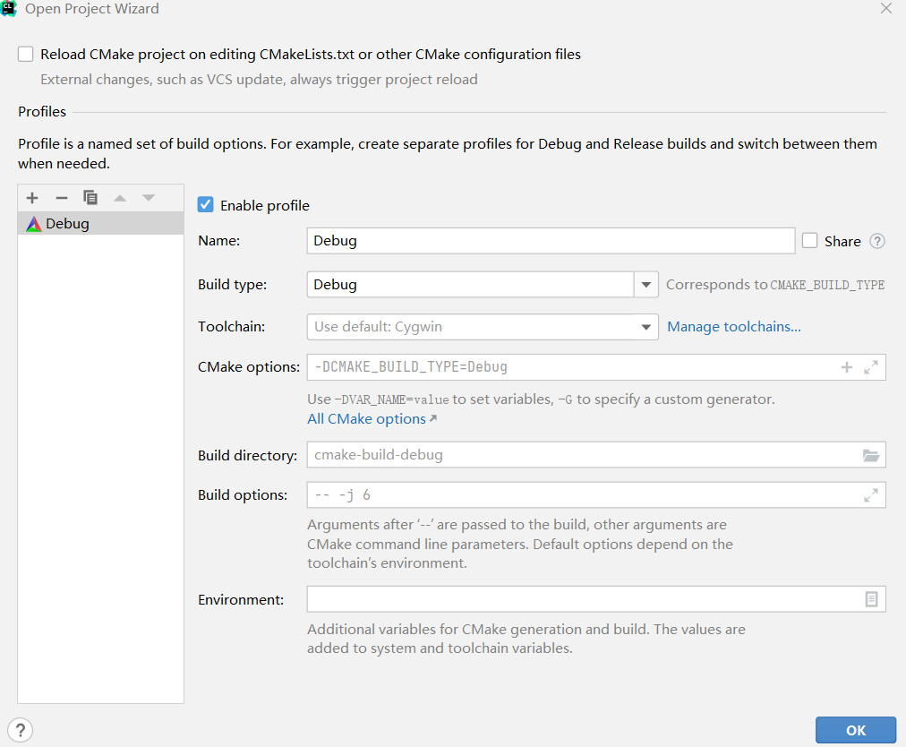

# Lab1: X老师的小程序

[toc]

X老师需要一个统计和计算学生成绩的小程序，以协助他录入学生成绩、计算课程均分以及查看学生的学分绩。
学生名单、课程列表和学生的选课情况已经存在于文本文件中，小程序需要从这些文件中读出内容并建立相应的对象，以完成后续的成绩录入和计算工作。

学生名单存在于文件 `Students.txt` 中，其中学生分为本科生（Undergraduate）和研究生（Graduate），分别以字母 `U` 和 `G` 表示，文件格式如下（`#` 开头的是注释）：

```
# id;name;year;degree
F180370001;Apple;2019;U
B180370010;Boy;2018;G
```

课程列表和学生选课情况存在于文件 `Classes.txt` 中，文件每一段表示一个课程和选择该课程的学生学号列表，格式如下（`#` 开头的是注释）：

```
# Class name and points followed by student ids
Class:ICS
Points:5
F180370001
F180370002

Class:English
Points:3
F180370003
B180370001

Class:ADS
Points:2
B180370001
B180370002
```

小程序需要实现的功能主要有以下三个：

1. 记录成绩：记录某一门课程的一名学生的成绩，为了简便该程序不要求将成绩写入文件，只需存储在内存中即可。
2. 计算课程平均分：在成绩录入完成以后，选择一门课程并计算出该课程所有选课学生的平均分。
3. 计算学生学分绩：在成绩录入完成以后，选择一名学生并计算 ta 的学分绩。其中本科生和研究生的学分绩计算方法不同，本科生的总学分绩是 5.0，计算方法是每门课程的分数除以 20 然后按照学分数量加权平均；研究生的总学分绩是 4.0，计算方法是先分档次记分：90～100分 => 4.0，80～89分 => 3.5，70～79 => 3.0，60～69 => 2.5，60以下 => 2.0，然后再按照学分数量加权平均。

小程序通过命令行与用户进行交互，用户通过输入一些特定的命令、课程名、学号和成绩来完成操作流程，流程图如下：



在系统设计中，类的关系要求如下：



其中 `getGrade` 函数是 `Student` 类的**纯虚函数**，它的子类 `Undergraduate` 和 `Graduate` 继承后具体实现了 `getGrade` 函数。（图例可参考：https://en.wikipedia.org/wiki/Class_diagram）


## 任务

1. 小程序的部分代码已经给出，现在需要你将其补全（即解决所给代码中所有的 `TODO`）: 

   1. 从 `Classes.txt` 文件中读出课程列表和学生选课情况，将其创建成对应的对象；
   2. 实现 `Student` 类、`Undergraduate` 类和 `Graduate` 类；
   3. 完成计算课程平均分功能、记录成绩功能和计算学生学分绩功能。
2. 所给代码中 `StudentWrapper` 类的构造函数是有错误的，请改正这个错误**详细**说明原因（创建一个新的 `BugReport.txt` 文本文件进行说明）。
3. 处理程序异常输入，例如输入不存在的课程名、学号或者无效的分数时程序不应该崩溃（提示：考虑使用`try...catch`）。


## 提交

注意，作业的完成包括两部分：

1. 完成作业后，在**抽查**名单上的同学需要在上机课时找到助教进行功能演示，表明程序可以运行，且完成了规定的功能；
2. **所有同学**都需要提交项目代码到 Canvas 平台。

提交时请将你完成的项目代码（请不要包含生成的中间文件和可执行文件）和说明文件 `BugReport.txt` 打包（格式为 7z）命名为 `lab1-XXX.7z` 上传到 Canvas 中，其中 `XXX` 为你的学号。


解压后你的项目目录结构大概是下面这样，可以有一些小的区别，比如多一些你自己使用的小文件。

```
lab1
├── Class.cc
├── Class.h
├── Classes.txt
├── Student.cc
├── Student.h
├── Students.txt
├── main.cc
├── BugReport.txt
├── CMakeLists.txt
└── spec
    ├── lab1.md
    ├── lab1.pdf
    ├── sep-lab1-class.png
    ├── sep-lab1-liucheng.png
    └── sep-lab1-clion.png
```


> 由于 zip 格式有中文乱码问题，rar 的压缩工具为收费软件，请使用 7z 格式进行打包和压缩，关于 7z 压缩的工具：
>
> - Windows 可使用 https://www.7-zip.org 或其他支持7z格式的压缩工具
> - MacOS 可使用 Keka （https://www.keka.io/） 等
> - Linux 可使用 p7zip （`sudo apt install p7zip-full`）等


## 关于 Clion 的一些使用提示

1. 在解压缩之后，你可以直接使用 Clion 打开 `lab1` 文件夹，建议将 `lab1` 文件夹放在全英目录下，否则可能会出现本地编译不通过的情况。

2. 使用 Clion 打开后会出现如下所示的配置确认，直接点 OK 即可。**注意：请不要修改 CMakeLists.txt 文件中的内容！**

   

   如果没有自己跳出可以自行右击 `lab1` 文件夹选择 `Reload Cmake Project` 来生成 `cmake-build-debug`。 

3. 请注意**不要**提交本地的 `cmake-build-debug` 文件夹。

4. 之后，可以通过点击运行和调试按钮来尝试运行项目。注意，第一次运行项目并不会编译通过，因为所给代码中 `StudentWrapper` 类的构造函数是有错误的，请自己完成修改。


## 补充说明

为执行统⼀的测试脚本，现统⼀规定SEP-2022-lab1的输出格式。对于所有计算数据输出均保留两位小数
具体格式如下：**（请注意空格和换行）**

**成绩计算**

```
printAvgScore: "The average score is: %.2f\n"
printGpa: "GPA = %.2f\n"
```

**异常处理**

```
成绩格式错误，命令行输出："Wrong score!\n"
课程名称错误，命令行输出："No match class!\n"
学生ID输⼊错误，命令行输出： "No match student!\n"
```

**测试用例**

lab1文件夹中已经给出了一个测试用例的输入（spec/input0.txt）和输出（spec/output0.txt），在你认为完成后请先自行在本地进行测试，方便定位自己的问题。（注意敲对输入！仔细对比输出！）


### 1. 关于测试结果的说明

#### 1.1 xxxxxx(line xx)

给出的错误信息（line xx）意思是在一个测试里输出到第几行的时候出错了，因为一个测试里会要求不止一条输出。比如line 2说明输出的0和1行内容是对的，在第2行错了。

line xx表示的是助教这里的答案的行数，不是你们程序运行结果的行数。

#### 1.2 错误处理

"Wrong score!"不匹配

- Test #%d: Fail. Exception handle(score) error

"No match class!"不匹配

- Test #%d: Fail. Exception handle(class) error

"No match student!"不匹配

- Test #%d: Fail. Exception handle(student) error

#### 1.3 数值计算错误

含有"The format of"的信息表示输出格式肯定不对，没有该信息的是计算错误或格式错误（保留小数）。

#### 1.4 其他

"Answer is too short"表示输出的结果进过匹配后发现答案缺失。

**"Compile error...No such file..."表示作业提交格式没有按照说明提交（含lab1文件夹且不要修改名称）。**


### 2. 测试结果可能的错误原因

#### 2.1 程序本身计算错误

#### 2.2 多余输出信息

这里的多余输出信息不是说不能输出辅助信息，而是在给出的《lab1.pdf》文档中规定的输出不是以换行结束的。也就是说这一行输出的末尾要和说明匹配，不能有多余的信息赘述在这行的后面。（这行的前面有多余信息是不影响的）。

正确示例：

```cmd
jdlfjs111kdj000fjlsdkf--jljjs....some_info_. ....sjfldsjkfGPA = 96.00
GPA = 96.00
```

错误示例：

```cmd
jdlfjs111kdj000fjlsdkf--jljjs....some_info_. ....sjfldsjkfGPA = 96.00please input ...
```

#### 2.3 多余的错误处理

这里的多余意思是，把正确的输入也通过文档中的三种错误信息格式进行输出。


### 3. 什么时候测试

**并不是你提交了就立刻有结果的！！！**

测试结果只有我这里跑了测试脚本才会上传到课程网站。

隔30分钟测试一次。


### 4. 我自己跑的是通过的，为什么助教那里的没有过

有一些同学在问助教测试为什么过不了，测试数据是不会公开的。测试用例有一部分是非常基础的测试，不包含错误处理，大家可以先考虑过正常流程。这里提示一下，正常流程是**【输入课程和学生成绩（不止一个课程，一个课程也不止一个学生），查询课程平均分（不止一个），查询学生GPA（不止一个）】**

助教这里也不会告诉你为什么错了，毕竟一个一个人查助教一个人也没有精力做到，可以确定的是如果程序都正确肯定得分是100，不用怀疑测试脚本的问题。

#### 额外提示

**测试用例1-4、7最终需要的结果是不含错误处理信息的**

**一定一定要注意输出格式！！！每一个字母每一个空格每一个空行都要一样！！！**

**测试判断的流程是：如果一行输出含有《lab1.pdf》文件中要求的任意一种输出语句，那么会判定这一行为一行答案，与助教的标准答案的一行进行匹配。所以给同学们的错误提示，不一定就是与之相关的问题。比如说，“GPA is wrong.”这个提示不一定是GPA计算错误，也可能是你的输出含有GPA = xx，而助教的答案这一行是错误处理的“Wrong score!”之类的信息。再比如说，“Exception handle(class) error.”这个提示不一定是课程异常处理出错，非常可能是因为你的输出含有No match class!，而助教的答案这一行不是错误信息，而是gpa或者score等其他信息。**


### 5. 其他问题汇总

#### 5.1 得分范围的切分

不存在89-90这种范围内的奇怪测试数据，可以不考虑

#### 5.2 成绩输入错误的下一步，回到输入学生ID这一步

#### 5.3 查询均分出现非法输入返回输入查询均分这一步；查询绩点出现非法输入返回输入查询绩点这一步（都是同一步不断循环）

#### 5.4 整个输入成绩过程出现要求输入课程名时，输入非法课程名返回输入课程名这一步

#### 5.5 我的程序为什么读文件都读不成功？

请参考《lab1.pdf》的使用提示。

#### 5.6 使用mac电脑的同学们注意：如果遇到mac电脑运行不过的程序在windows上能过/输入的字符串和存储的字符串总是不相等？

注意对于输入文件处理的时候，字符串需要把macos系统默认的换行符'\r'做丢弃处理