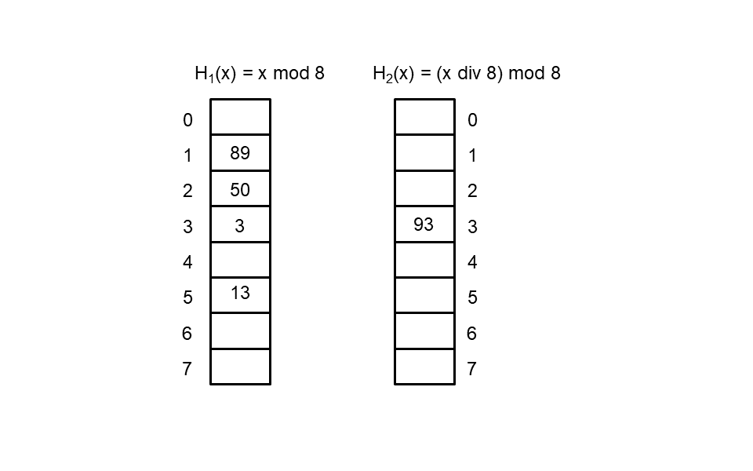
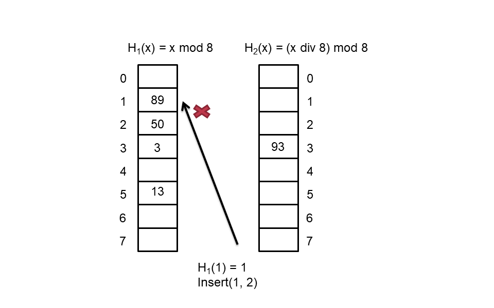
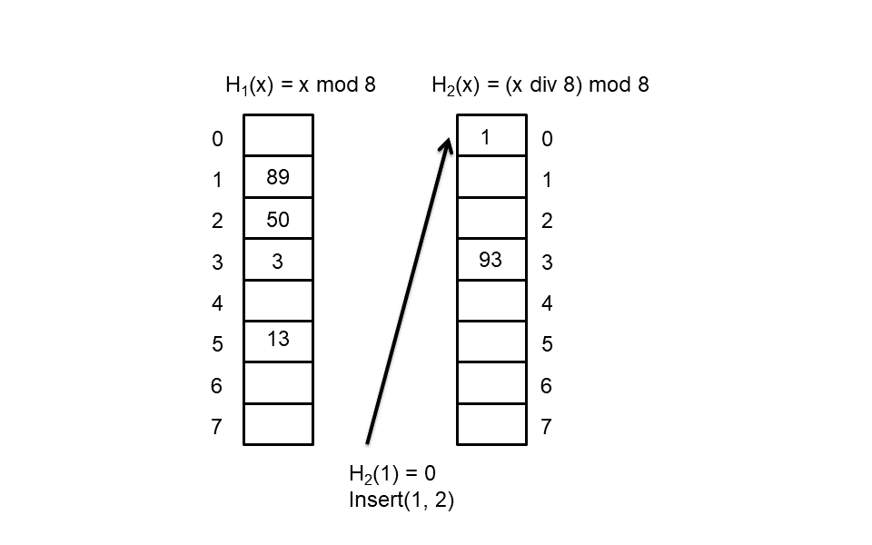
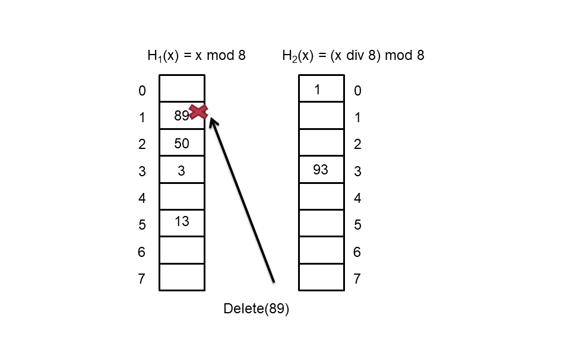
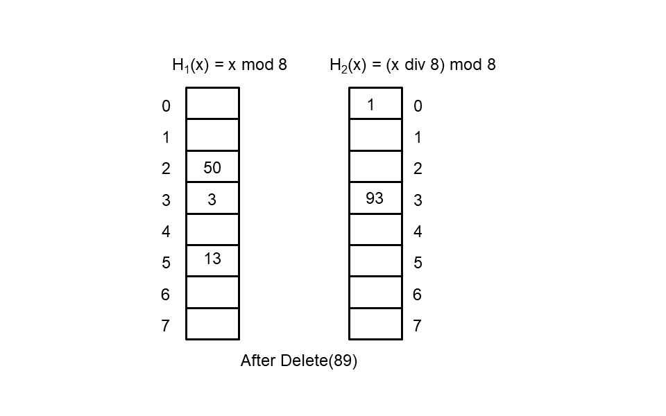
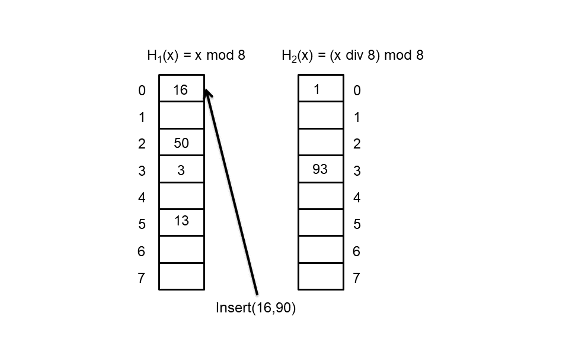
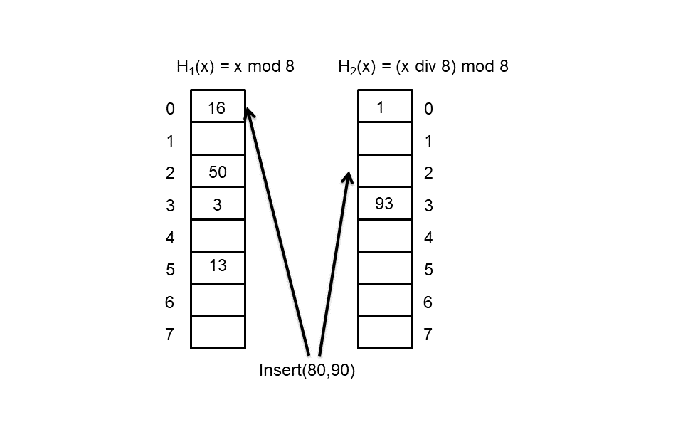
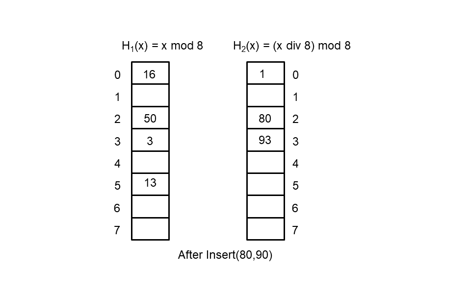
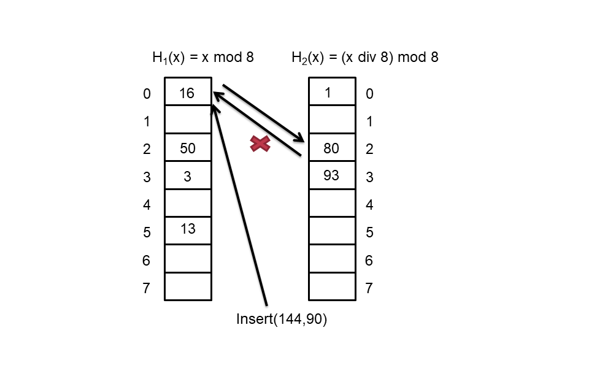

# Lab5 CUCKOO hashing

## Background

### Hashing

哈希表（散列表，Hash Table）具有 3 个基本的操作：

1. `Lookup(key)`：在哈希表中查找 Key，如果 key 在表中存在则返回对应的 value，否则返回 没
2. `Insert(key, value)`：如果 key 不在表中，则向表中增加 key 和 value
3. `Delete(key)`：从表中删除 key 和其对应的 value

即使表非常大，但依旧可能出现冲突（根据 Birthday Paradox [1]，在仅有 23 人的情况下，有两人生日相同的可能性高达 50%）。针对哈希冲突问题，通常采取以下两种解决方法：

1. 分离链表法（Separate Chaining）[2]，即教材 9.6.5 中的“开散列表”（Open Hashing）
   - 哈希表中的每个单元都指向一个链表，链表中的 Key 具有相同的哈希值
2. 开放地址法（Open Addressing）[3]
   - 允许元素溢出到其他空间，如教材中的线性探测、二次探测和再散列法

尽管上述解决方法预期的时间复杂度是 `O(1)` 的，但是最坏情况下，两种解决方法的时间复杂度高达`O(N)`（考虑每个插入的 Key 的哈希值均相同）。


### Cuckoo Hashing


布谷鸟，又称杜鹃、子规、喀咕。部分种类的布谷鸟会将他们的卵产在其他鸟的巢中，由其他鸟代为孵化和育雏 [4,5]。


#### 基本介绍

Cuchoo Hashing 是一种特殊的哈希表实现方法，其综合使用以下两种思想，保证在最坏情况下，查找的时间复杂度为`O(1)`：

1. 多选择哈希值（Multiple-Choice Hashing），即每一个元素有多种位置可选。

   Cuckoo Hashing 使用两个数组存放 Key，每个数组对应一个哈希函数，分别为 `H1` 和 `H2`。因此，对于每个 key，使用这两个哈希函数可以计算出其在两个数组中的位置：`H1(key)` 和 `H2(key)` ，该 key 如果存在哈希表中，则必定保存在其中一个位置上。

2. 重定位哈希（Relocation Hashing）,即允许哈希表中的元素在存放之后重新移动。

   在进行插入是，如果 `H1(key)` 和 `H2(key)` 均被其他 key 所占用，Cuckoo Hashing 需要进行重定位操作。这个过程类似于布谷鸟的将其他鸟的卵挤出巢外的行为，这也是该算法得名的原因。所以，在Cuckoo Hashing中，向cuckoo hashing table中插入一个新的key可能会导致原来的旧值被踢到一个不同的地方。这个过程会产生以下两种结果：

   - 如果被踢出的旧值有空位存放，那么不会产生任何问题
   - 否则，踢出的旧值就会继续踢出其他的键。这个过程将会不断重复，直到最后一个被踢出的键能够找到空位存放或形成了一个环。如果整个过程形成了一个环，那么就需要重新选择哈希方法并对整个表进行重新哈希散列。重新哈希散列的过程可能会有多次，直到成功为止。

#### 具体操作

**插入 Insert**

预期复杂度：`O(1)`，在最坏情况下会进行重新哈希（即重新散列）

插入操作的流程如下：

1. 计算 `key` 在两个数组中的位置 `H1(key)` 和 `H2(key)` ；

2. 如果 `H1(key)` 是空闲的，则将 key 插入到 `H1(key)` 中，插入过程结束；

3. 如果 `H2(key)` 是空闲的，则将 key 插入到 `H2(key)` 中，插入过程结束；

4. 进行 Kick 操作：将 `key` 插入到 `H1(key)` 中，并将 `H1(key)` 中原有的 `keyh1` 拿出来，计算其在第二个数组中的位置 `H2(keyh1)`，
   - 如果该位置空闲，则将 `keyh1` 存放在 `H2(keyh1)` ，插入过程结果；
   - 如果该位置（`H2(keyh1)`）被占用，将 `keyh1` 存放到该位置，并该位置原有的  `keyh1h2`  拿出来，计算  `keyh1h2`  在第一个数组中的位置 `H1(keyh1h2)`，重复进行 Kick 操作。
   - Kick 操作不断进行，有两种结果：
     - 最终找到一个空位，成功完成了插入操作；
     - 位置链产生了一个环，说明无法通过一系列 Kick 操作完成插入，需要进行 resize/rehash 操作。

5. resize/rehash：将哈希表中的两个数组分别扩充为原来的两倍，并将其中保存的值重新进行哈希，并进行位置调整：
   - hash function
     ```c++
      H1(key) = key%size;
      H2(key) = (key/size)%size;
      //size: size of a single hash table 
     ```
     
   - resize	

     - 形成环的时候，进行扩容，大小变为原表的2倍。
     
   - rehash

     - 扩大哈希表容量之后，需要对原有的键值对进行rehash，重新放入新的哈希表中。**这里规定 rehash 顺序为**，从 table0 到 table1，每个数组中从小到大进行遍历，将每个位置上的键值对进行 rehash，最后再将手中剩余的一个键值对插入新表。

     - 即，如伪代码所示：

       ```
       for i from 0 to table_size
       	rehash(table0[i])
       for i from 0 to table_size
       	rehash(table1[i])
       insert(remain_key)
       ```

6. **注意**：如果插入的 key-value 对中的 key 已经在 hash table 中存在，则更新 value

7. **关于环的检测：** 如果一次插入操作,触发了 2*size 次 kick 操作，则认定为存在环。其中 size 为单个数组的大小。

**查询(Lookup)**

最坏时间复杂度：`O(1)`

通过两个哈希函数，最多只需要检查两个位置，就能找到需要查找的目标，或得出该 key 不在哈希表中。

```c++
/*
procedure:
	step1: use function `hash` to get the target positions
	step2: compare values stored in hash table with your target and get the right answer
*/
```

**删除(Delete)**

最坏时间复杂度：`O(1)`

先查找，如果找到则进行删除操作。

```c++
/*
procedure:
	step1: use function `hash` to get the possible positions
	step2: compare values stored in hash table with your target and get the right answer
	step3: remove the value stored in target position
*/
```

## 实例解析

接下来，我们尝试通过一系列例子来理解cuckoo hash的相关操作。

回顾一下我们使用的2个hash函数分别为：

```c++
H1(key) = key % size;
H2(key) = (key / size) % size;
//size: size of a single hash table 
```

我们令初始的$size = 8$， 假定算法执行过程中的中间状态如下图所示，其中，

- 我们将左边的数组命名为table 0，使用$H_1$作为哈希函数
- 右边的数组称为table 1，使用$H_2$作为哈希函数：



这时，我们插入键值对(key=1,val=2), 算法执行的中间过程如下图，我们先调用H1查看左边的数组是否有空位，发现该位置被占了：



接着我们调用H2函数，查询在右边数组的位置，$H_2(1) = 0 $发现该位置为空，可以插入，则我们把指定键值对插入对应位置



则这时的算法状态如下：


接着，我们尝试调用Delete，我们根据$H_1(89) = 1 $得到89在左边数组中的位置，我们将其删除。




删除后的情况如下图所示：



接着我们看看成环的情况：我们连续插入16和80，如下图所示：



我们插入80



这时，算法的状态为：



这时我们插入144，就会出现成环的情况：



## 题目要求

##### 总体要求：

​	实现上述Insert,Lookup,Delete操作，

- 为简化题目，题中出现的所有key，value都使用int类型。
- 2个数组的初始长度都为8。

##### 具体要求：

1. 从标准输入中读入所需操作，输出到标准输出，评测会根据标准输出的内容判断算法实现是否正确
2. 从标准输入中读入M，代表M行操作
3. 读入M行操作时,  每行操作可能的情况为
   - `Insert key1`: 表示调用Insert(key,val)，**如果本来就存在这个key，则更新原来的val，否则就插入这个新的键值对。**
     - **kick路径的具体输出**
       - 针对每一次的kick操作
       - 输出`Kick old_key with new_key in table table_no table_index `
       - 其中`old_key`是位置上原有的key值
       - `new_key`是新的key值，用于替换旧值
       - `table_no`:代表选择的table，取值为0或1
       - `table_index`:代表选择的table中的index
     - **成环的具体输出**：
       - 判断出成环之后输出`Loop Detect`
     - 发现成环后需要进行 resize 操作，具体的流程参照之前的描述。
   - `Lookup key`: 表示调用Lookup(key)
     - 若key存在，则输出对应的val值
     - 若key不存在，则输出`Key Not Found`
   - `Delete key`: 表示调用Delete(key)
     - 若key存在，则进行删除，不输出
     - 若key不存在，则输出`Key Not Found`

##### 提交要求：

- 本次 lab 未提供项目文件框架，需要自己构建。

- 提交时请将你完成的项目代码（请不要包含生成的中间文件和可执行文件）打包（格式为 7z）并命名为 `main.7z` 上传到 Canvas 中。

- 你的项目代码文件应该**有且仅有** cuckoo.cpp、main.cpp 和 cuckoo.h 这三个文件。

- 解压后你的项目目录结构是应该是下面这样：

  ```
  lab5
  ├── cuckoo.cpp
  ├── cuckoo.h
  └── main.cpp
  ```


##### 测试样例：

```
M					// the number of lines below (M=9 here)
Insert key1 val1	
Insert key2 val2
Insert key3 val3	// ==> output: Kick key1 with key3 in table 1 8
Lookup key1			// ==> output: val1
Lookup key5			// ==> output: Key Not Found
Delete key4			// ==> output: Key Not Found
Lookup key4			// ==> output: Key Not Found
Delete key1			
Lookup key1			// ==> output: Key Not Found
```

```
5
Insert 16 0
Insert 80 1
Lookup 16						//==> output:0
Lookup 17						//==> output:Key Not Found
Insert 144 2					
								//==> output:Kick 16 with 144 in table 0 0
								//==> output:Kick 80 with 16 in table 1 2
								//==> output:Kick 144 with 80 in table 0 0
								//==> output:Kick 16 with 144 in table 1 2
								//==> output:Kick 80 with 16 in table 0 0
								//==> output:Kick 144 with 80 in table 1 2
								//==> output:Kick 16 with 144 in table 0 0
								//==> output:Kick 80 with 16 in table 1 2
								//==> output:Kick 144 with 80 in table 0 0
								//==> output:Kick 16 with 144 in table 1 2
								//==> output:Kick 80 with 16 in table 0 0
								//==> output:Kick 144 with 80 in table 1 2
								//==> output:Kick 16 with 144 in table 0 0
								//==> output:Kick 80 with 16 in table 1 2
								//==> output:Kick 144 with 80 in table 0 0
								//==> output:Kick 16 with 144 in table 1 2
								//==> output:Loop Detect
```

更多详细例子可以参见sample.in, 和sample.out

# References

[1]: Birthday Paradox <https://www.geeksforgeeks.org/birthday-paradox/> 

[2]: Hashing | Set 2 (Separate Chaining) <https://www.geeksforgeeks.org/hashing-set-2-separate-chaining/>

[3]: Hashing | Set 3 (Open Addressing) <https://www.geeksforgeeks.org/hashing-set-3-open-addressing>

[4]: 巢寄生 <https://zh.wikipedia.org/wiki/巢寄生>

[5]: Cuckoo <https://en.wikipedia.org/wiki/Cuckoo>

[6]:  Cuckoo Hash 样例： https://programming.guide/cuckoo-hashing.html